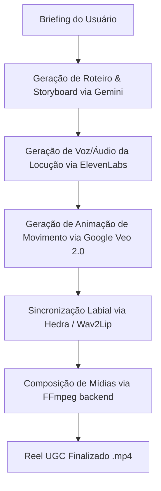

# Plano de Implementação: Áudio, Animação de Personagens e Timeline de Múltiplas Fotos

Este documento apresenta a especificação técnica e arquitetura recomendada para a implementação de geração automática de voz (TTS), sincronização labial (Lipsync) / animação e suporte expandido a múltiplas fotos mapeadas por cena.

---

## 1. Arquitetura do Fluxo de Geração

O fluxo de processamento será assíncrono e passará a seguir as seguintes etapas:

---

## 2. Configurações de API & Chaves Necessárias

Para ativar o sistema completo, as seguintes chaves de API e configurações devem ser fornecidas no arquivo `.env.local` na raiz do projeto:

### A. Google Gemini / Veo API
*   **Variável:** `GEMINI_API_KEY` (usada pelo `VeoProvider` para gerar movimentos de câmera e simulações na foto).
*   **Onde obter:** [Google AI Studio](https://aistudio.google.com/).

### B. ElevenLabs (Locução por Voz)
*   **Variável:** `ELEVENLABS_API_KEY` (utilizada pelo `ElevenLabsProvider` para gerar a voz realista).
*   **Onde obter:** Painel da [ElevenLabs](https://elevenlabs.io/).

### C. Hedra API (Lipsync)
*   **Variável:** `HEDRA_API_KEY` (utilizada pelo `HedraProvider` para animar a boca e as expressões faciais do personagem de acordo com o áudio gerado).
*   **Onde obter:** Portal do Desenvolvedor da [Hedra](https://www.hedra.com/).

### D. Supabase & Banco de Dados (Persistência e Armazenamento de Mídia)
*   **Variáveis:**
    *   `NEXT_PUBLIC_SUPABASE_URL`
    *   `NEXT_PUBLIC_SUPABASE_ANON_KEY`
    *   `SUPABASE_SERVICE_ROLE_KEY`
    *   `NEXT_PUBLIC_SUPABASE_STORAGE_BUCKET=project-images`
*   **Configuração Necessária:** Criar um Bucket público chamado `project-images` no Supabase Storage com políticas de leitura pública e permissão de upload/escrita para usuários anon/autenticados.

---

## 3. Alterações Propostas nos Arquivos

### 3.1 Interface do Usuário (Uploads Mapeados)
*   **Arquivo:** [projects/[id]/page.tsx](file:///c:/Users/jc-pr/.gemini/antigravity/scratch/clickmarido/src/app/projects/%5Bid%5D/page.tsx)
*   **Alteração:** Modificar a aba "Imagens" para listar as 5 cenas geradas pelo Storyboard. Cada cena terá seu próprio botão de upload dedicado, permitindo que o usuário envie a imagem exata correspondente a cada parte da narrativa (evitando repetição automática).

### 3.2 Renderização Local e Composição FFMPEG
*   **Arquivo:** [video-generator.ts](file:///c:/Users/jc-pr/.gemini/antigravity/scratch/clickmarido/src/services/video/video-generator.ts)
*   **Alteração:** Ajustar a função `generate()` para ler as imagens indexadas por cena de forma explícita e ler a URL do áudio de locução gerado (`project.audioUrl`), integrando-o ao stream de gravação.
*   **Arquivo:** [video-compositor.ts](file:///c:/Users/jc-pr/.gemini/antigravity/scratch/clickmarido/src/services/video/video-compositor.ts)
*   **Alteração:** Ajustar os filtros do FFmpeg para sincronizar a trilha de música instrumental com a trilha de voz de locução gerada pelo ElevenLabs, aplicando uma redução automática de volume na música (ducking) enquanto a voz fala.

### 3.3 Orquestração Assíncrona no Worker
*   **Arquivo:** [workers/index.ts](file:///c:/Users/jc-pr/.gemini/antigravity/scratch/clickmarido/src/workers/index.ts)
*   **Alteração:** Implementar a lógica sequencial de chamadas de APIs no handler `handleVideoRender`, garantindo tratamento de erros e atualização dos estados na store do Zustand e no Supabase.

---

## 4. Plano de Validação

1.  **Geração Isolada de Áudio:** Testar a rota de API local de geração de TTS com textos curtos e vozes em português.
2.  **Processamento da Imagem no Veo:** Enviar uma imagem do Click Marido para a API do Veo 2.0 e garantir que retorne um vídeo com movimento coerente.
3.  **Execução do Lipsync:** Processar o vídeo gerado pelo Veo juntamente com o áudio do TTS na API do Hedra e validar a sincronização labial.
4.  **Composição Final (FFmpeg):** Executar o script de montagem no servidor local para gerar o arquivo `.mp4` final contendo vídeo animado, narração por voz, legenda renderizada e música de fundo.
